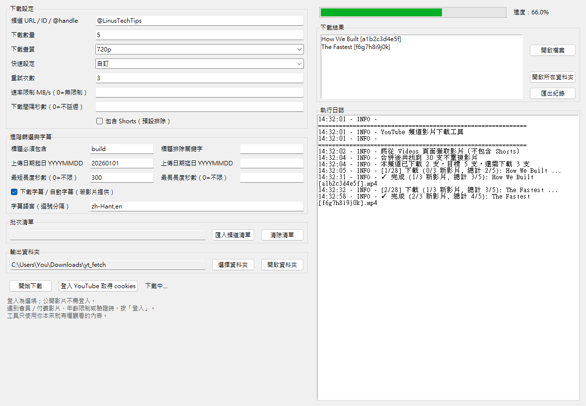

# YouTube 頻道影片下載工具

[English](README.en.md)

[](https://github.com/SanHsien/yt_fetch/actions/workflows/code-check.yml)
[](https://github.com/SanHsien/yt_fetch/actions/workflows/codeql.yml)
[](https://github.com/SanHsien/yt_fetch/actions/workflows/dependency-freshness.yml)
[](https://github.com/SanHsien/yt_fetch/releases)
[](https://www.python.org/)
[](#)
[](LICENSE)
[](https://github.com/SanHsien/yt_fetch)
[](https://github.com/SanHsien/yt_fetch)
[](https://github.com/SanHsien/yt_fetch)
[](https://github.com/SanHsien/yt_fetch/issues)
[](https://github.com/SanHsien/yt_fetch)

從指定 YouTube 頻道取得最新的 N 支影片並下載為 mp4，儲存到 `download/` 資料夾。

網路上已有眾多功能類似的工具；本專案主打的是**輕巧、可攜、具 GUI、簡潔易懂**，讓使用者能用免安裝單檔程式完成常見的個人備份需求，而不是追求大而全的下載器。

> ✨ **亮點：能下載你自己付費的會員影片。** 內建「登入 YouTube」一鍵取得 cookies（已克服 Chrome 127+ App-Bound Encryption 無法讀取 cookies 的難題），用你自己的登入身分下載你**本來就有權觀看**的內容——包括**你自己訂閱／付費的頻道會員影片**、年齡限制影片等。屬「已授權存取」，**非繞過付費牆**（你未付費的內容仍會被 YouTube 拒絕）。

> ⚠️ **重要提醒**：本工具僅供個人學習與研究使用。請遵守 YouTube 服務條款與著作權法。

## 🖼️ 畫面截圖

[](docs/screenshots/main-window.png)

> 圖形介面（`--gui`）：填入頻道與選項即可下載，下載於背景進行、即時顯示進度條、日誌與結果。

> 截圖以確定性方式產生（示範資料、不含真實 cookies 或個人路徑）：`python tools/generate_readme_screenshot.py`；流程見 [docs/screenshot-workflow.md](docs/screenshot-workflow.md)。

## ⬇️ 下載（Windows 免安裝 EXE）

不想安裝 Python 的話，可直接下載打包好的 Windows 執行檔：

1. 到 [Releases](https://github.com/SanHsien/yt_fetch/releases) 下載 `yt_fetch-<版本>-windows-x64.zip`
2. 解壓後雙擊 `yt_fetch.exe` 即可開啟圖形介面
3. 影片會下載到 exe 同目錄的 `download/` 資料夾
4. 可用同壓縮檔內的 `.sha256` 檔驗證完整性

> EXE 由 GitHub Actions 在推送 `v*` 標籤時於 Windows 自動建置並發佈（見 `.github/workflows/release.yml`）。
> 想自行建置：在 Windows 上 `pip install -e ".[build]"` 後執行 `python build_exe.py`，產物為 `dist/yt_fetch.exe`。

> **EXE 更新提醒**：Windows EXE 會把建置當下的 `yt-dlp` 一起打包進去。YouTube 改版時，舊 EXE 可能會失效。
> 若遇到抓不到影片，請先到 Releases 確認是否有新版；從原始碼執行的使用者可用 `pip install -U yt-dlp`
> 更新下載核心。

> **Windows SmartScreen**：目前 EXE 未做程式碼簽章，第一次執行可能出現「Windows 已保護你的電腦」。
> 若你確認檔案來自本專案 Releases，可點「其他資訊」→「仍要執行」。

## 功能特色

- ✅ **圖形介面（GUI）**：Tkinter 桌面介面，並可打包為 Windows 免安裝 EXE
- ✅ **輕巧可攜**：維持單檔核心與清楚流程，Windows 使用者可直接使用免安裝單檔程式
- ✅ **自動環境管理**：自動建立虛擬環境並安裝所需套件
- ✅ **跨平台支援**：Windows、macOS、Linux 皆可使用
- ✅ **互動式與命令列雙模式**：可直接執行互動詢問參數，或使用命令列參數快速執行
- ✅ **畫質選項**：可選 `best`、`1080p`、`720p`、`480p`，會下載不高於指定上限的最佳可用畫質
- ✅ **GUI 批次下載**：可匯入頻道清單，循序下載多個頻道，單一頻道失敗不會中斷整批
- ✅ **GUI 快速設定**：提供最佳畫質、省空間 720p、低畫質 480p 等常用 profiles
- ✅ **智能格式選擇**：自動檢測並安裝 ffmpeg，合併所選畫質與最佳音質
- ✅ **ffmpeg 狀態檢查**：GUI 可顯示目前使用系統 ffmpeg 或 `imageio-ffmpeg`，以及版本與路徑
- ✅ **冪等性保證**：重複執行不會下載已存在的影片
- ✅ **保守存取邊界**：自動過濾私人、未列出、無權存取等內容；cookies 僅用於你自己已授權可觀看的影片
- ✅ **登入取得 cookies（Windows/Chrome）**：內建受控瀏覽器登入，解決 Chrome 127+ App-Bound Encryption 導致無法讀取 cookies 的問題；可用你自己的登入身分下載你本來就有權觀看的內容（年齡限制、自己訂閱的頻道會員影片等），不繞過任何未付費的存取限制
- ✅ **Shorts 過濾**：預設排除 Shorts，可選包含（支援 YouTube 頻道 Videos/Shorts 分頁）
- ✅ **詳細日誌與 GUI 進度條**：完整的下載過程記錄、進度顯示、結果清單與匯出紀錄
- ✅ **錯誤診斷**：針對 cookies、會員權限、限流、ffmpeg、磁碟權限等常見錯誤給出下一步

## 系統需求

- Python 3.10 或更高版本
- **ffmpeg**（必需）：用於合併最佳畫質和音質的影片

## 安裝

### 方法一：自動安裝（推薦）

腳本會自動建立虛擬環境並安裝所需套件，無需手動安裝：

```bash
python yt_fetch.py --channel "@channel_handle"
```

### 方法二：手動安裝

如果您想手動管理依賴：

```bash
# 建立虛擬環境
python -m venv .venv

# 啟動虛擬環境
# Windows:
.venv\Scripts\activate
# macOS/Linux:
source .venv/bin/activate

# 安裝依賴
pip install -r requirements.txt
```

### 方法三：以套件方式安裝（可取得 `yt-fetch` 指令）

若以可編輯模式安裝專案，可使用 `yt-fetch` 指令：

```bash
pip install -e .
yt-fetch --channel "@channel_handle"
```

`yt-fetch` 的參數與 `python yt_fetch.py` 相同。

## 使用方法

### 圖形介面（GUI，推薦新手）

不熟命令列的話，可啟動桌面圖形介面，在視窗中填入頻道、數量等參數：

```bash
python yt_fetch.py --gui
```

以可編輯模式安裝後（`pip install -e .`），也可用 `yt-fetch-gui` 指令啟動。

GUI 沿用與 CLI 完全相同的下載邏輯，下載於背景執行不卡住視窗，並即時顯示日誌與下載結果。可匯入頻道清單做循序批次下載、選擇／開啟下載資料夾、設定標題／日期／長度進階篩選、下載字幕、開啟單一下載檔案或所在資料夾，並匯出本次下載紀錄。

> GUI 使用 Python 內建的 Tkinter。少數精簡版 Python（常見於 Linux）需另裝 `python3-tk`；Windows / macOS 官方安裝版通常已內建。

### 方法一：互動式執行（推薦新手）

直接執行腳本，會以互動方式詢問所有必要參數：

```bash
python yt_fetch.py
```

執行後會依次詢問：
- **頻道**：YouTube 頻道 URL、ID 或 @handle（必填）
- **目標檔案數**：要下載的影片數量（預設：5，直接按 Enter 使用預設值）
- **是否包含 Shorts**：y/n（預設：n，直接按 Enter 使用預設值）
- **下載畫質**：`best`、`1080p`、`720p`、`480p`（預設：best）
- **重試次數**：下載失敗時的重試次數（預設：3，直接按 Enter 使用預設值）

### 方法二：命令列參數執行（推薦進階用戶）

直接使用命令列參數執行，無需互動輸入：

```bash
python yt_fetch.py --channel "@channel_handle"
```

### 命令列參數

| 參數 | 說明 | 預設值 | 範例 |
|------|------|--------|------|
| `--channel` | 頻道 URL、ID 或 @handle（未提供時會以輸入視窗詢問） | - | `--channel "@pewdiepie"` |
| `--count` | 下載數量 | 5 | `--count 10` |
| `--include-shorts` | 包含 Shorts（預設排除） | False | `--include-shorts` |
| `--quality` | 下載畫質：`best`、`1080p`、`720p`、`480p`；解析度選項會選不高於上限的最佳可用畫質 | best | `--quality 720p` |
| `--retries` | 重試次數 | 3 | `--retries 5` |
| `--cookies-from-browser` | 從瀏覽器讀取 cookies（處理年齡/地區限制，可指定 profile） | - | `--cookies-from-browser chrome:Default` |
| `--cookies` | cookies 檔案路徑（Netscape 格式） | - | `--cookies cookies.txt` |
| `--ratelimit` | 下載速率限制（MB/s，0 表示無限制） | 0 | `--ratelimit 5` |
| `--sleep` | 每次下載之間的延遲秒數（減少被限流） | 0 | `--sleep 2` |
| `--title-include` | 只下載標題包含指定文字的影片 | - | `--title-include Python` |
| `--title-exclude` | 排除標題包含指定文字的影片 | - | `--title-exclude Shorts` |
| `--date-after` | 只下載此日期之後（含）的影片，格式 `YYYYMMDD` | - | `--date-after 20260101` |
| `--date-before` | 只下載此日期之前（含）的影片，格式 `YYYYMMDD` | - | `--date-before 20261231` |
| `--min-duration` | 只下載長度不少於指定秒數的影片，0 表示不限制 | 0 | `--min-duration 300` |
| `--max-duration` | 只下載長度不超過指定秒數的影片，0 表示不限制 | 0 | `--max-duration 1800` |
| `--write-subs` | 同時下載字幕／自動字幕（若影片提供） | False | `--write-subs` |
| `--sub-langs` | 字幕語言，逗號分隔 | `zh-Hant,zh-Hans,en` | `--sub-langs zh-Hant,en` |
| `--channels-file` | 批次下載：檔案每行一個頻道（`#` 為註解） | - | `--channels-file channels.txt` |
| `--gui` | 啟動圖形介面（其餘參數於視窗中設定） | False | `--gui` |
| `--login` | 開啟受控瀏覽器登入 YouTube 一次並保存 cookies（Windows/Chrome；見下方說明） | False | `--login` |

### cookies 怎麼處理（GUI vs CLI）

多數公開影片不需要 cookies。只有在你自己的帳號已經能合法觀看某些內容，但 YouTube 需要登入狀態確認時才需要。

- **GUI**：沒有手動 cookies 欄位。需要時直接按「**登入 YouTube 取得 cookies**」按鈕（見下方 Chrome 127+ 說明），之後下載會自動沿用。
- **CLI**：以下兩個參數擇一（進階／非 Chrome 用途，例如 Firefox 或自備 cookies.txt）：
  - **`--cookies-from-browser`**：填 `chrome`、`firefox` 或 `edge`，可指定 profile（`chrome:Default`、`chrome:Profile 1`）。在 Windows/Chrome 上會自動改走受控瀏覽器登入（見下方）。
  - **`--cookies`**：Netscape 格式 `cookies.txt` 的檔案路徑，例如自瀏覽器擴充匯出的檔案。

不建議兩個 CLI 參數同時填；設定檔不會保存 cookies 內容。這些選項只可用於你自己有權存取的內容，不能用來繞過付費牆、會員限定、私人影片或其他存取限制。

### Chrome 127+ 登入取得 cookies（受控瀏覽器，Windows）

> **此功能為選填。** 公開影片完全不需要登入或 cookies；只有需要登入狀態時才用得到。

從 **Chrome 127 起**，Google 啟用了 **App-Bound Encryption（ABE）**：cookie 解密金鑰被綁定在 Chrome 執行檔本身，因此 `yt-dlp`（以及任何外部工具）在 Windows 上**已無法直接讀取 Chrome 的 cookies**，常見表現就是 `failed to load cookies`。

為此本工具提供「**受控瀏覽器登入**」：它會開啟一個**本工具專屬、與你日常 Chrome 完全獨立**的瀏覽器實例，讓你在裡面登入 YouTube，再透過 Chrome DevTools Protocol 取得「**Chrome 自己解密後**」的 cookies。整個過程不需要關閉你平常的 Chrome、不觸碰你的主要設定檔。

受控瀏覽器的遠端偵錯介面只監聽本機 `127.0.0.1`；匯出的 cookies 也只保留
YouTube 登入所需的 `youtube.com`、`google.com` 與 `googlevideo.com` 網域，不會把其他網站的
瀏覽 cookies 寫入本工具的 `cookies.txt`。

使用方式（擇一）：

- **GUI**：點主畫面的「**登入 YouTube 取得 cookies**」按鈕，在彈出的視窗登入即可。
- **命令列**：執行 `yt_fetch.exe --login`（或 `python yt_fetch.py --login`），在彈出的視窗登入。

登入成功後，cookies 會保存在 `%LOCALAPPDATA%\yt_fetch\cookies.txt`，**之後 GUI 下載會自動沿用，並在每次執行時於背景（headless）自動刷新**，通常不需要再手動登入，直到 cookies 自然過期為止；過期時再按一次登入即可。CLI 使用 `--cookies-from-browser chrome` 時，也會優先改用這份受控 cookies。

#### 可以下載「你自己付費／訂閱」的會員影片

當你**本人**已經是某頻道的**付費會員或頻道會員（Membership）**、或購買了某個付費內容時，登入後你的帳號**本來就有權觀看**這些影片，因此本工具可以用你的登入身分把它們下載下來（**僅限個人使用**，並請遵守 YouTube 服務條款與著作權規定）。

這同樣適用於：**年齡限制**影片、或 YouTube 因偵測為機器人而要求登入確認的情況。

> ⚠️ **界線（很重要）**：cookies 只是「以你本人的登入身分」存取，**不是付費牆的破解**。你**沒有**加入會員／沒有購買的頻道內容，YouTube 會在伺服器端驗證你的帳號權限並拒絕存取——cookies 幫不上忙，本工具也**不會、不能、且不實作**任何繞過會員、付費牆、私人影片、年齡或地區限制的功能。

### 環境變數

所有參數都可以透過環境變數設定：

```bash
# Windows (PowerShell)
$env:YOUTUBE_CHANNEL="@channel_handle"
$env:YOUTUBE_COUNT="10"
$env:YOUTUBE_INCLUDE_SHORTS="1"
$env:YOUTUBE_QUALITY="720p"
$env:YOUTUBE_RETRIES="5"
$env:YOUTUBE_COOKIES_BROWSER="chrome"
$env:YOUTUBE_RATELIMIT="5"
$env:YOUTUBE_SLEEP="2"
$env:YOUTUBE_TITLE_INCLUDE="Python"
$env:YOUTUBE_TITLE_EXCLUDE="Shorts"
$env:YOUTUBE_DATE_AFTER="20260101"
$env:YOUTUBE_DATE_BEFORE="20261231"
$env:YOUTUBE_MIN_DURATION="300"
$env:YOUTUBE_MAX_DURATION="1800"
$env:YOUTUBE_WRITE_SUBS="1"
$env:YOUTUBE_SUB_LANGS="zh-Hant,en"
python yt_fetch.py

# macOS/Linux
export YOUTUBE_CHANNEL="@channel_handle"
export YOUTUBE_COUNT=10
export YOUTUBE_INCLUDE_SHORTS=1
export YOUTUBE_QUALITY=720p
export YOUTUBE_RETRIES=5
export YOUTUBE_COOKIES_BROWSER=chrome
export YOUTUBE_RATELIMIT=5
export YOUTUBE_SLEEP=2
export YOUTUBE_TITLE_INCLUDE=Python
export YOUTUBE_TITLE_EXCLUDE=Shorts
export YOUTUBE_DATE_AFTER=20260101
export YOUTUBE_DATE_BEFORE=20261231
export YOUTUBE_MIN_DURATION=300
export YOUTUBE_MAX_DURATION=1800
export YOUTUBE_WRITE_SUBS=1
export YOUTUBE_SUB_LANGS=zh-Hant,en
python yt_fetch.py
```

### 設定檔（yt_fetch.ini）

程式（或 exe）旁會自動產生一個 `yt_fetch.ini`，記住你的常用設定，下次啟動自動帶入。
GUI 會在每次下載後把當下的設定寫回，CLI 也會讀取它作為預設值。

- 會保存：頻道、數量、重試、是否含 Shorts、下載畫質、速率限制、下載間隔、進階篩選、字幕設定、下載資料夾。
- **不會保存 cookies**（檔案路徑與瀏覽器來源都不寫入）。
- 可手動編輯；格式錯誤的項目會被忽略並回退內建預設。

優先序（高 → 低）：

```
CLI 參數  >  環境變數（YOUTUBE_*）  >  設定檔 yt_fetch.ini  >  內建預設
```

範例 `yt_fetch.ini`：

```ini
[yt_fetch]
channel = @channel_handle
count = 10
retries = 3
include_shorts = false
quality = best
ratelimit = 0
sleep = 0
title_include =
title_exclude =
date_after =
date_before =
min_duration = 0
max_duration = 0
write_subs = false
sub_langs = zh-Hant,zh-Hans,en
download_dir =
```

### 批次下載多個頻道

把頻道清單放進一個文字檔（每行一個，`#` 開頭為註解）：

```text
# my_channels.txt
@channel_one
https://www.youtube.com/@channel_two/videos
UCxxxxxxxxxxxxxxxxxxxxxx
```

然後：

```bash
python yt_fetch.py --channels-file my_channels.txt --count 5
```

- 每個頻道各自抓最新 N 支（`--count` 以頻道計）。
- **單一頻道失敗不會中斷整批**，結束後會列出每個頻道的成功/失敗與下載數總結。
- 維持保守的循序下載（不做大量平行下載）。

### 頻道 URL 格式

支援多種頻道識別方式：

- **@handle 格式**：`@channel_handle`
- **完整 URL**：`https://www.youtube.com/@channel_handle`
- **頻道 ID**：`UCxxxxxxxxxxxxxxxxxxxxxx`
- **頻道 URL**：`https://www.youtube.com/channel/UCxxxxxxxxxxxxxxxxxxxxxx`

完整網址只接受 HTTPS 的 YouTube 主機（含 `youtu.be`）；HTTP、其他網站、內嵌帳密或非標準
連接埠會直接拒絕。

### 使用範例

#### 互動式執行範例

```bash
# 直接執行，會以互動方式詢問所有參數
python yt_fetch.py

# 執行後會詢問：
# 頻道: @channel_handle
# 數量: 10          （直接按 Enter 使用預設值 5）
# 包含 Shorts: n    （直接按 Enter 使用預設值 n）
# 下載畫質: 720p    （直接按 Enter 使用預設值 best）
# 重試次數: 5       （直接按 Enter 使用預設值 3）
```

#### 命令列參數執行範例

```bash
# 下載最新 5 支影片（指定頻道，其他使用預設值）
python yt_fetch.py --channel "@channel_handle"

# 下載最新 10 支影片
python yt_fetch.py --channel "@channel_handle" --count 10

# 包含 Shorts
python yt_fetch.py --channel "@channel_handle" --include-shorts

# 限制下載畫質為 720p 以內
python yt_fetch.py --channel "@channel_handle" --quality 720p

# 使用完整 URL
python yt_fetch.py --channel "https://www.youtube.com/@channel_handle/videos"

# 使用瀏覽器 cookies 處理年齡/地區限制
python yt_fetch.py --channel "@channel_handle" --cookies-from-browser chrome

# 使用 cookies 檔案
python yt_fetch.py --channel "@channel_handle" --cookies cookies.txt

# 限制下載速率並添加延遲（減少被限流）
python yt_fetch.py --channel "@channel_handle" --ratelimit 5 --sleep 2

# 只下載標題含 Python、2026 年後上架、5 分鐘以上的影片
python yt_fetch.py --channel "@channel_handle" --title-include Python --date-after 20260101 --min-duration 300

# 同時下載字幕／自動字幕（若影片提供）
python yt_fetch.py --channel "@channel_handle" --write-subs --sub-langs zh-Hant,en

# 增加重試次數（網路不穩定時）
python yt_fetch.py --channel "@channel_handle" --retries 5

# 完整參數範例
python yt_fetch.py --channel "@channel_handle" --count 10 --include-shorts --quality 720p --retries 5 --ratelimit 5 --sleep 2
```

## 輸出

下載的影片會依**頻道名稱**分別存到 `download/` 底下的子目錄，避免多個頻道混在一起：

```
download/<頻道名稱>/%(title)s [%(id)s].mp4
```

例如：`download/PAPAYA 電腦教室/我的影片標題 [dQw4w9WgXcQ].mp4`

（下載紀錄 `download/.download_archive.txt` 仍為共用；重複偵測會遞迴掃描所有子目錄，也相容舊版直接放在 `download/` 根目錄的檔案。）

## 冪等性

腳本會自動記錄已下載的影片，重複執行時不會重複下載：

- 使用 yt-dlp 的 download archive（`download/.download_archive.txt`）
- 檢查檔案名稱中的影片 ID

`--count` 以「該頻道」為單位計算：腳本會比對本頻道已下載的影片數量，只補足還缺的部分；不會因為其他頻道已下載的影片而少抓。如果本頻道目標數量已滿足，會顯示「已達到本頻道目標數量」並結束。

## ffmpeg 安裝（必需）

ffmpeg 是必需的，用於合併最佳畫質和音質的影片（會自動合併最佳影片和音訊流）。如果未安裝，腳本會提示錯誤並退出。

### Windows

```bash
# 使用 Chocolatey
choco install ffmpeg

# 或從官網下載
# https://ffmpeg.org/download.html
```

### macOS

```bash
brew install ffmpeg
```

### Linux

```bash
# Debian/Ubuntu
sudo apt-get install ffmpeg

# CentOS/RHEL
sudo yum install ffmpeg

# Fedora
sudo dnf install ffmpeg
```

**注意**：ffmpeg 是必需的，未安裝時腳本會報錯退出。請務必先安裝 ffmpeg。

## 常見問題

### Q: 出現 "ffmpeg not found" 錯誤？

**A:** ffmpeg 是必需的。請安裝 ffmpeg（見上方安裝指引）。腳本會自動檢測並在未找到時提示安裝方法。

### Q: 找不到影片？

**A:** 請確認：
- 頻道 URL 是否正確
- 頻道是否為公開
- 嘗試使用 `@handle` 格式而非完整 URL

### Q: 為什麼有些影片沒有下載？

**A:** 未提供 cookies 時，本工具只下載「可公開觀看的 VOD」。提供自己的合法 cookies 後，
會員／Premium／需登入候選會交由 YouTube 伺服器驗證帳號原有權限；未授權仍會被拒絕。
本工具一律跳過：
- 私人影片
- 未列出影片
- 直播中（live）、預告（upcoming）、已結束直播（was_live）等 Live 內容

沒有 cookies 時也會跳過訂閱者專屬、Premium 專屬與需要認證的影片。這個流程只保留
「使用者本來就有權觀看」的已授權存取，不繞過任何限制。

### Q: 下載失敗或網路錯誤？

**A:** 嘗試增加重試次數：
```bash
python yt_fetch.py --channel "@channel" --retries 5
```

### Q: 下載畫質怎麼選？

**A:** 預設 `best` 會下載 yt-dlp 判斷的最佳可用畫質。若選 `1080p`、`720p` 或 `480p`，工具會下載「不高於該解析度上限」的最佳可用畫質；如果影片本身沒有該解析度，會自動退到較低可用畫質。

### Q: 權限錯誤？

**A:** 確保您有寫入 `download/` 資料夾的權限。

### Q: 如何排除 Shorts？會下載直播嗎？

**A:** 預設已排除 Shorts，也不會下載直播。YouTube 從 2022 年起將頻道分為 Videos、Shorts、Live 三個分頁：
- `/videos` 頁面只包含長片（本工具預設只從這裡下載）
- `/shorts` 頁面只包含 Shorts（只有在 `--include-shorts` 時才額外抓取）
- `/live` 與相關直播內容會透過 `live_status` 自動排除，僅保留 VOD

行為說明：
- 當 **不包含 Shorts**（預設）時，本工具只從 `/videos` 頁面獲取，並使用 `match_filter` 進一步排除 URL 含 `/shorts/`、或「時長 < 60 秒且標題/描述標記 shorts」的影片（未標記的正常短片不會被誤殺）
- 當 **包含 Shorts**（`--include-shorts`）時，本工具會同時從 `/videos` 和 `/shorts` 兩個頁面獲取，再合併與去重

如需包含 Shorts，使用 `--include-shorts` 參數；直播影片一律不下載。

### Q: 遇到年齡限制或地區限制的影片？

**A:** 使用 `--cookies-from-browser chrome`（或其他瀏覽器）或 `--cookies cookies.txt` 來提供登入 cookies，可以處理年齡/地區限制。注意：這不會繞過付費牆。

### Q: 如何減少被 YouTube 限流？

**A:** 可以使用以下策略：
- `--ratelimit 5`：限制下載速率為 5 MB/s
- `--sleep 2`：每次下載之間等待 2 秒
- 兩者結合使用效果更好

### Q: 如何清除下載記錄？

**A:** 刪除 `download/.download_archive.txt` 檔案即可。

## 退出碼

- `0`：成功（有下載或已冪等）
- `1`：參數錯誤或網路錯誤
- `2`：需要 ffmpeg 但未安裝且無法回退

## 發展路線圖

- **產品定位**：維持「輕巧、可攜、具 GUI、簡潔易懂」的個人備份工具，不做成大型萬用下載器。CLI 保留為穩定入口；GUI 作為主要日常介面。
- **已完成基礎**：Windows 免安裝 EXE、Tkinter GUI、CLI/GUI 共用下載核心、受控瀏覽器登入 cookies、畫質選項、進階篩選、字幕下載、多頻道批次下載、依頻道名稱分子目錄、結果報表、ffmpeg 狀態頁、依賴新鮮度檢查與 Release workflow。
- **維護路線圖完成狀態**：下載流程已抽出 `build_ytdlp_options()`、`_extract_entries()`、`dedupe_entries()`、`calculate_download_target()`、`prepare_entries_to_download()`、`download_entries_with_ytdlp()`、ffmpeg 準備、progress hook、match filter、候選掃描數量與 yt-dlp 錯誤處理 helper。錯誤診斷已集中到核心分類與提示表，CLI/GUI 共用同一套診斷。GUI 已以分區整理下載設定、批次清單、輸出資料夾、下載結果與執行日誌；`docs/planning/` 已收斂成現況規格、完成狀態、暫不納入項目與可選未來項目。
- **下載核心維護守則**：新增或修正下載行為時，優先改對應 helper 與測試，不回到整段 `download_videos()` inline 修改。遇到 YouTube 或 yt-dlp 行為變動，先補可重現測試，再調整提取、候選、下載迴圈、成功判斷或錯誤處理的局部 helper。
- **錯誤診斷維護守則**：真實使用中遇到新的 yt-dlp、cookies、ffmpeg、磁碟權限、限流與存取權限錯誤時，補進核心分類器與提示表，讓 CLI/GUI 同步受益。
- **GUI 維護守則**：現有功能已足夠，後續只在能改善「快速設定、看懂狀態、知道下一步」時調整 UI；優先整理版面密度、文字長度、cookies/ffmpeg/批次狀態與結果區呈現，不堆更多設定面板。
- **批次下載原則**：維持循序處理，避免大量平行下載造成限流或服務壓力。
- **發布維護**：只有依賴新鮮度、實際下載問題或核心修正需要使用者取得新版 EXE 時才切 tag 重發。每月 dependency freshness workflow 會比較 repo 宣告的 `yt-dlp`／`imageio-ffmpeg` 基線與 PyPI；每週 Dependabot 另檢查全部 Python 直接依賴與 GitHub Actions。CI 直接覆蓋的低風險 patch／minor PR 會在完整 CI 與 CodeQL 通過後自動核准、合併；重大版本、執行期與發布／打包依賴維持人工審查。每次 Release 固定列出內建 `yt-dlp` 版本、主要變更、已知限制與 SHA256。
- **可選但非優先**：格式轉換可在需求明確時評估；目前固定 MP4，避免增加 ffmpeg 錯誤面與 GUI 複雜度。

### 暫不做

- 繞過 YouTube 付費牆、會員限定、私人影片、地區限制或其他存取控制（即存取你「無權觀看」的內容）。
- 將使用者 cookies/token 外傳、上傳、分享、交換或外洩給任何第三方。
- 大量平行下載或規避限流。
- 自動上傳雲端硬碟或第三方儲存服務。
- Web UI、排程守護程式、新影片提醒或系統通知；這些會讓專案偏離免安裝單檔 GUI 工具定位。

> 關於 cookies：cookies 相關功能（含 Chrome 127+ 受控登入）只在你本機抽取並使用「你自己」的 cookies，存於本機 `cookies.txt`、絕不外傳。它讓你用自己的登入身分下載「本來就有權觀看」的內容（例如你自己付費／訂閱的頻道會員影片、年齡限制影片）——這是「已授權存取」，**不是繞過**；你未付費或無權的內容，YouTube 仍會在伺服器端拒絕。

## 貢獻

歡迎貢獻！請查看 [CONTRIBUTING.md](CONTRIBUTING.md) 了解如何參與專案。

## 安全

如果您發現安全漏洞，請查看 [SECURITY.md](SECURITY.md) 了解如何回報。

## 授權

本專案採用 [MIT License](LICENSE) 授權。

## 免責聲明

本工具僅供個人學習與研究使用。下載內容請遵守：

- YouTube 服務條款
- 著作權法
- 相關法律法規

使用者需自行承擔使用本工具的所有責任。

## 技術細節

- **依賴套件**：yt-dlp>=2026.7.4、imageio-ffmpeg>=0.6.0
- **Python 版本**：3.10+
- **虛擬環境**：自動建立 `.venv`
- **CLI 指令**：`pip install -e .` 後可使用 `yt-fetch`
- **下載目錄**：`download/`
- **Archive 檔案**：`download/.download_archive.txt`

## 疑難排解

如果遇到問題，請檢查：

1. Python 版本是否為 3.10 或更高
2. 網路連線是否正常
3. 頻道是否公開，或內容是否可用你自己的登入身分合法存取
4. 是否有足夠的磁碟空間
5. 查看日誌輸出的詳細錯誤訊息

## 更新日誌

詳細的更新記錄請查看 [CHANGELOG.md](CHANGELOG.md)。

### 主要功能

- 自動環境管理
- 跨平台支援
- 智能格式選擇（需 ffmpeg）
- 下載畫質選項（best / 1080p / 720p / 480p）
- 進階篩選（標題、日期、長度）與字幕下載
- 冪等性保證
- Shorts 過濾功能（支援 YouTube 頻道分頁：Videos/Shorts/Live，預設只從 Videos 頁面獲取）
- 保守存取邊界（自動過濾私人、未列出、無權存取等內容）
- 限制播放清單提取數量，避免觸發 YouTube 限流
- 強制使用 watch URL 下載，避免 m3u8 格式問題
- 使用 progress hook 追蹤實際下載檔名，確保檔案正確識別
- 互動式輸入視窗（未提供 --channel 時會詢問）
- Cookies 支援（處理年齡/地區限制）
- 下載速率限制和延遲策略（減少被限流）

